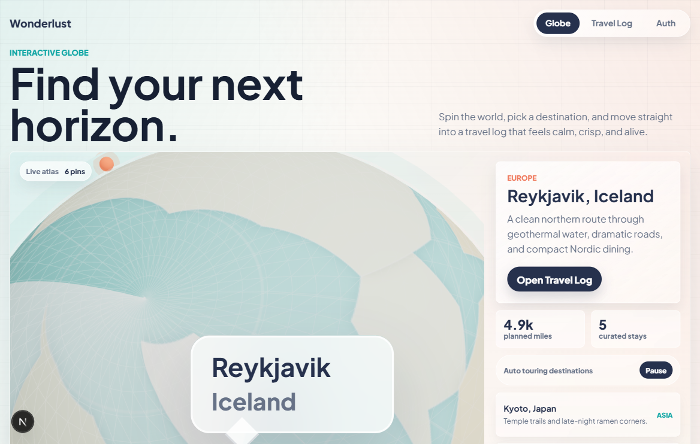
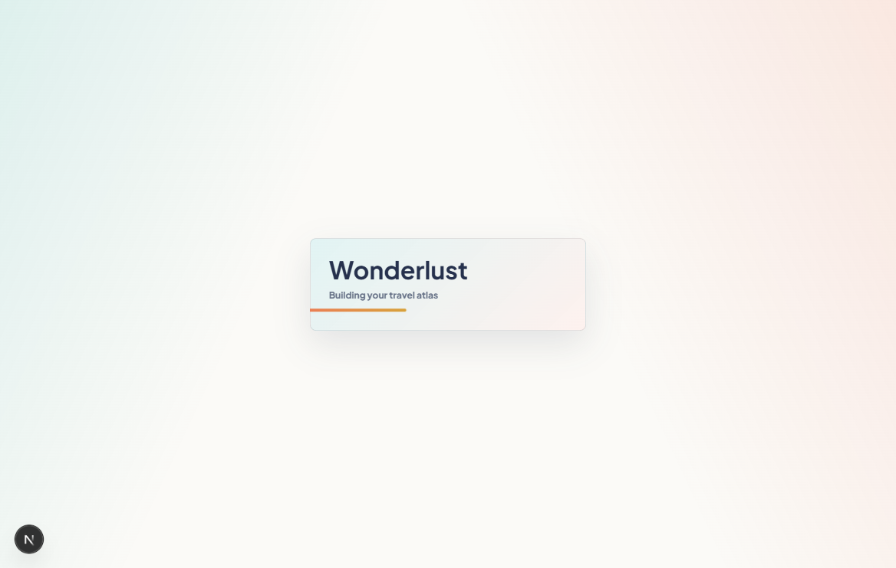

# Wonderlust

Wonderlust is a polished travel-planning demo built as a portfolio-ready product interface. It combines a cinematic Three.js globe, destination-aware trip planning, glassmorphism UI, Supabase-ready data flows, and a responsive Travel Log dashboard.

Built by **Shakil Ahmed**.



## Why This Project Exists

Wonderlust is designed to feel like a real product demo, not a static landing page. Recruiters and reviewers can immediately see interactive frontend work, product thinking, responsive design, typed data modeling, animation polish, and backend readiness in one focused app.

## Highlights

- **Interactive 3D globe:** Destinations are mapped by latitude/longitude, with clickable pins, active labels, smooth globe focus, and an auto-touring destination carousel.
- **Destination-aware Travel Log:** Opening a destination passes route context into the dashboard, so each place has its own demo itinerary, highlights, budget, trip length, timeline, and saved plans.
- **Smart trip suggestions:** A preference-based planner suggests destinations and starter plans using curated 2026 travel inspiration from Lonely Planet and National Geographic.
- **Modern glass UI:** White-themed glassmorphism with translucent panels, layered blur, soft borders, responsive spacing, and polished loading transitions.
- **Supabase-ready architecture:** The app has auth, migrations, row-level-security policies, typed data helpers, and graceful demo fallback content.
- **Portfolio polish:** Includes a case-study section, footer attribution, accessible focus states, reduced-motion support, and verification scripts.

## Screenshots

### Globe Explorer

The home screen uses a large 3D globe on the left and a destination control panel on the right. The active destination, map label, card state, and Travel Log route stay in sync.


### Travel Log Dashboard

The Travel Log page turns a selected destination into a richer product surface with itinerary details, timeline entries, saved plans, stats, and continent progress.



## Tech Stack

- **Framework:** Next.js App Router
- **Language:** TypeScript
- **3D:** Three.js with React Three Fiber and Drei
- **Animation:** Framer Motion
- **Backend-ready:** Supabase JS client, SQL migration, RLS policies
- **Testing:** Vitest and Testing Library
- **Styling:** Global CSS design system with glassmorphism tokens

## Core Routes

- `/` - interactive globe, destination cards, recommendation planner, footer
- `/travel-log?destination=kyoto` - destination-aware dashboard
- `/auth` - Supabase magic-link auth demo

## Getting Started

Install dependencies:

```bash
npm install
```

Create a local environment file:

```powershell
copy .env.example .env.local
```

Add your Supabase values:

```env
NEXT_PUBLIC_SUPABASE_URL=https://your-project-id.supabase.co
NEXT_PUBLIC_SUPABASE_ANON_KEY=your-anon-key
```

Run the development server:

```bash
npm run dev
```

Open:

```text
http://127.0.0.1:3000
```

## Supabase Setup

The database migration lives at:

```text
supabase/migrations/20260505_init_wonderlust.sql
```

It includes:

- `user_profiles`
- `destinations`
- `trip_logs`
- `continent_progress`
- `travel_stats` view
- Row-level-security policies scoped to authenticated users

The app still works without Supabase credentials by falling back to rich local demo data.

## Verification

Run TypeScript checks:

```bash
npx tsc --noEmit
```

Run tests:

```bash
npm run test
```

Create a production build:

```bash
npm run build
```

## Portfolio Talking Points

- Demonstrates 3D frontend work with realistic interaction logic, not just decorative canvas usage.
- Shows route-aware UI state between the globe and dashboard.
- Uses typed destination data and backend-ready helper boundaries.
- Balances motion, glassmorphism, responsive layouts, and accessibility.
- Includes fallback data so the demo remains reviewable without backend setup.

## Inspiration Sources

- [Lonely Planet Best in Travel 2026](https://www.lonelyplanet.com/best-in-travel)
- [National Geographic Best of the World 2026](https://www.nationalgeographic.com/travel/article/best-of-the-world-2026)
